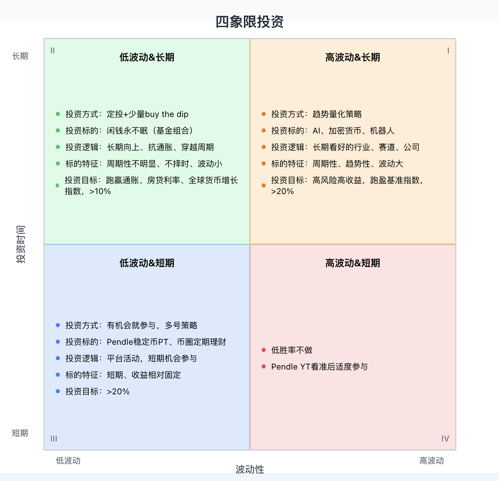
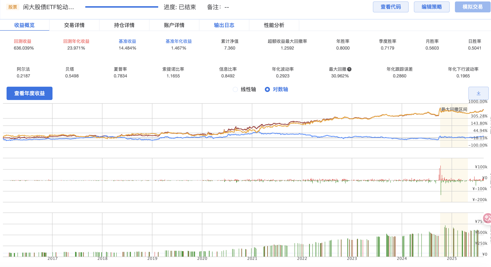
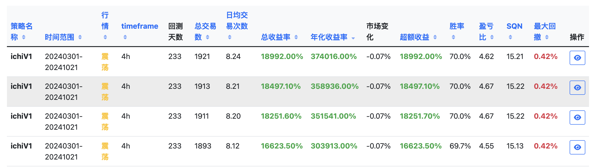

# 四象限投资体系

本人码农一枚，80后，赶在了房价顶峰入手，房贷压顶，目前追求低风险理财、做有把握的投资决策，目标是实现财富的稳健增长（基础目标: 跑赢房贷和通账）。基于上述背景，我制定了适合我当前情况的投资体系。追求相同目标的人群可以借鉴和使用。

> 本文内容仅做学习分享交流，不构成任何投资决策依据。

## 投资理念

1. 资产配置：第一条同时最重要一条，准确评估自身可接受的风险等级和投资目标，然后制定相应的资产配置比例; 不要把鸡蛋放到同一篮子里。
2. 投资明天：Do your own research，持续学习，提升认知能力，看准明天和未来的行业、赛道、公司
3. 做有把握的决策：不要赌，只做有把握的事，不要把结果寄托在别人身上; 安心睡觉，如果睡不着觉，说明投资决策有问题。
4. 用数据说话：用回测和实测来找到优异的投资策略

基于以上理念，制定出了下面的投资四象限。

## 投资四象限

### 高波动&长期

* 投资方式：趋势量化策略
* 投资标的：AI、加密货币、机器人；股债ETF轮动策略；BTC投资；MAG7投资
* 投资逻辑：长期看好的行业、赛道、公司
* 标的特征：周期性、趋势性、波动大
* 投资目标：高风险高收益，跑盈基准指数，APY>20%
* 配置比例: 15%

补充说明如下：
1. 为什么选择趋势量化策略：
   1. 量化策略：炒股了十多年，经历过牛市、熊市，但都没赚到钱，认知是一方面，但克服不了人性的缺陷是更多的原因。现在选择趋势性量化策略，程序化决策，用数据说话，摆脱人的干扰因素。参考：[《怪诞行为学》读书总结 - 最美Lily-bestoflily](https://blog.okay456okay.cn/booknote-predictably-irrational/#i-9)
   2. 趋势性策略：买入并长期持有是一种策略，趋势交易是另一各策略，并且可以跑赢前者，直观理解: 在市场反复波动过程中，趋势交易可以执行多次低买高卖操作，从而增加利润（跑盈基准指数的依剧）。
2. 通过持续的信息输入，提升认识，找到天花板非常高且目前在迅速发展的行业、赛道、公司
   1. AI：关注 海外独角兽 微信公众号; AIGCRank
   2. 加密货币：[SOSOValue分析看板](https://sosovalue.com/zh/dashboard/charts)(特别关注恐惧和贪婪指数)； [BTCBOXER](https://btcboxer.com/home)(抄底、逃顶、局部买卖); [MAG7.ssi](https://ssi.sosovalue.com/zh/buy/MAG7.ssi)
   3. 其它信息源： 
      * 公众号：猫笔刀、闲画生财、朱罗纪、终身黑白、望京博格
      * [加密货币资源大全](https://github.com/okay456okay/awesome-crypto)
3. 标的跟踪和管理工具：[投资明天 - 股票投资管理系统](https://invest.insightpearl.com/)
4. 周期性：经济周期、美元潮汐（美联储加息、降息）、技术周期（Gartner曲线（技术成熟度曲线）)
5. 趋势性: 趋势策略的基石。
6. 配置比例：基于波动性考虑，在错误的时间点进入或退出都会导致最终亏损，因此只能将长期不用的钱放进来。
7. 其它信息:
   1. 股债ETF轮动策略使用指南：https://www.insightpearl.com/etf-trotation-strategy/
   2. 加密货币量化策略评测: https://strategy.insightpearl.com/

股债ETF轮动策略：2016年1月4日-2025年8月20日，9年翻6倍+。 
 
加密货币交易策略：超越市场，找到最好的交易策略

### 高波动&短期

低胜率少做或不做
投资标的：Pendle YT、
投资目标：APY>40%
投资比例: 5%

补充说明如下：
1. 在这一块没有优势，因此少做或尽量不做。
2. 部分Pendle YT在快到期Implied APY会持续上涨，但目前没找到原因和没有详细的数据分析支持。
3. 部分币可能在某段时间内出现链上价格和交易所价格存在价差，需要提前写好准备好套利程序。
4. 关健在于收益率够高，通过某些操作或某种策略将风险降低, 将不确定性的变成确定性的机会。
5. 欢迎提供其它机会。

### 低波动&长期

* 投资方式：定投+少量buy the dip
* 投资标的：闲钱永不眠（基金组合）
* 投资逻辑：长期向上、抗通胀、穿越周期
* 标的特征：周期性不明显、不择时、波动小
* 投资目标：跑赢通账、房贷利率、全球货币增长指数，APY>10%
* 投资比例: 15%

补充说明如下：
1. 抗通账：中、美（全球Top2）两国最优秀的指数ETF；黄金价格与全球货币增长同步
2. 不择时：选择A股、美股、现金、债券、黄金，资产相关性比较低，定期均衡
3. 闲钱永不眠基金组合介绍：https://mp.weixin.qq.com/s/myFn7752lS4GtwKmaSx9DA
4. [比特币 vs 全球 M2 货币供应增长 | CoinGlass](https://www.coinglass.com/zh/pro/i/bitcoin-m2-supply-growth)

### 低波动&短期

* 投资方式：有机会就参与，多号策略
* 投资标的：Pendle稳定币PT、币圈定期理财
* 投资逻辑：平台活动，短期机会参与
* 标的特征：短期、收益相对固定
* 投资目标：APY>20%
* 投资比例: 60%

补充说明如下：
1. Pendle教程：[Pendle学院](https://pendle.insightpearl.com/)
2. Pendle机会发现：主要是PT和LP（YT风险太大，不在这个象限内）, [市场数据 - Pendle](https://mypendle.insightpearl.com/); [Markets | Pendle](https://app.pendle.finance/trade/markets)
3. 交易所定期理财机会：https://www.insightpearl.com/ (理财日报, 有小时级别企微通知群) ，注意非稳定币一定要做套保，即在买入现货的同时合约卖空。

## 交流分享

微信： InSightPearl21, Telegram: @insightpearl, 微信公众号：远见拾贝。 

所有投资和理财机会均在公众号和远见拾贝网站发布，欢迎关注和订阅。加入投资理财群, 获取赚钱第一手资讯。

个人作品：
* [远见拾贝 - 终身学习、终身投资，用远见洞察，赚确定性的钱。微信公众号: 远见拾贝。](https://www.insightpearl.com/)
* [投资明天 - 股票投资管理系统](https://invest.insightpearl.com/)
* [freqtrade-master - 策略回测](https://strategy.insightpearl.com/)
* [市场数据 - Pendle](https://mypendle.insightpearl.com/)
* [Pendle学院](https://pendle.insightpearl.com/)
* [加密货币资源大全，从入门到进阶，求精不求多，持续更新](https://github.com/okay456okay/awesome-crypto)
* [四象限图绘制工具](https://github.com/okay456okay/invest_matrix)